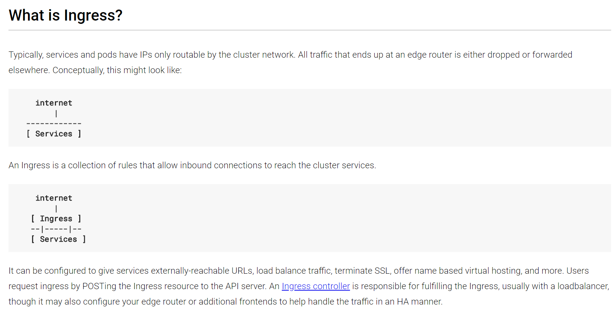
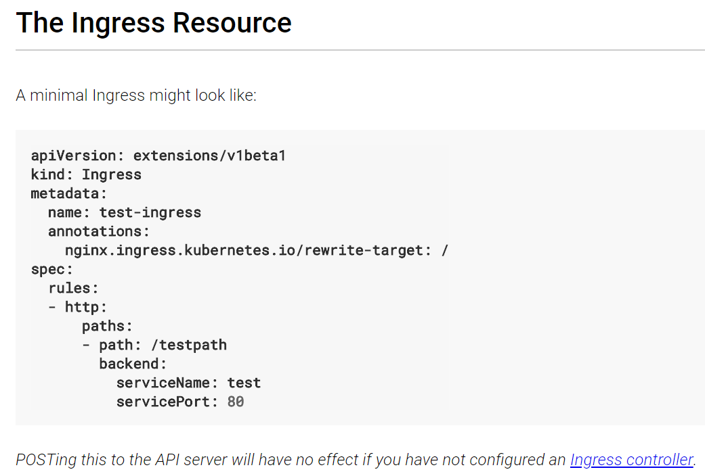
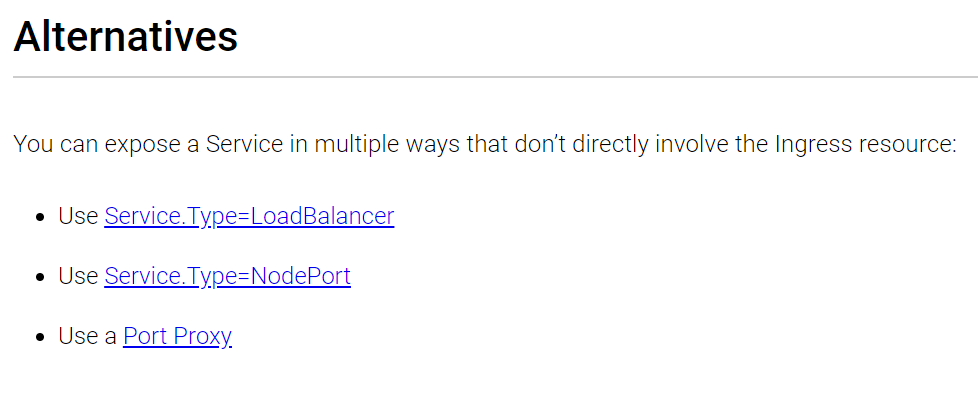

# Kubeless

## Conteúdo

* Setup Kubernetes
* Setup Kubeless no K8s
* Setup Kubeless CLI
* Functions
* Hello World (GET)
* Hello World 2 (POST e com Dependências)
* Acessando via proxy no Postman
* Abrindo a porteira da internet 1
* Abrindo a porteira da internet 2
* Outros Runtimes
* Exploring Kubeless in K8s
* Runtime do .NET Core (C#)
* Autoscaling

## Setup Kubernetes

1. Tenha um arquivo válido de configuração em `~/.kube/config`

2. Teste e veja se seu cluster está de pé:

```bash
$ kubectl get nodes

NAME                        STATUS  ROLES   AGE   VERSION
aks-agentpool-27559720-0    Ready   agent   1d    v1.9.6
aks-agentpool-27559720-1    Ready   agent   1d    v1.9.6
aks-agentpool-27559720-2    Ready   agent   1d    v1.9.6
```

3. Faça o proxy entre sua máquina e o cluster:

```bash
kubectl proxy &
```

4. Acesse a dashboard do kubernetes:

> <http://localhost:8001/api/v1/proxy/namespaces/kube-system/services/kubernetes-dashboard/#!/overview>

## Setup Kubeless no K8s

1. Baixe o release do yaml com as definições do kubeless em <https://github.com/kubeless/kubeless/releases>. Pegue a versão: kubeless-non-rbac-\*.yaml e baixe em seu computador (com wget). Exemplo:

```bash
wget https://github.com/kubeless/kubeless/releases/download/v1.0.0-alpha.2/kubeless-non-rbac-v1.0.0-alpha.2.yaml
```

2. Criar Namespace em k8s:

```bash
kubectl create ns kubeless
```

3. Deploy da instalação:

```bash
kubectl create -f kubeless-non-rbac-v1.0.0-alpha.2.yaml --namespace kubeless
```

4. Veja se está tudo bem:

```bash
$ kubectl get pods -n kubeless

NAME                                        READY   STATUS  RESTARTS AGE
kubeless-controller-manager-9b5bcf656-p7m5d 1/1     Running 0        4h
```

## Setup Kubeless CLI

1. Baixe a versão mais nova do Kubeless CLI release em <https://github.com/kubeless/kubeless/releases>

Pegue a versão: kubeless\_linux-amd64.zip

```bash
$ wget https://github.com/kubeless/kubeless/releases/download/v1.0.0-alpha.2/
kubeless_linux-amd64.zip

$ unzip kubeless_linux-amd64.zip
```

*"""opcional""":*
```bash
sudo mv bundles/kubeless_linux-amd64/kubeless /usr/local/bin/
```

## Functions

### Hello World (GET)

```bash
$ wget https://raw.githubusercontent.com/kubeless/kubeless/master/examples/python/helloget.py

$ cat helloget.py

$ kubeless function deploy hello --runtime python2.7 --from-file helloget.py \--handler helloget.foo

$ kubeless function ls hello

$ kubeless function call hello
```

## Hello World 2 (POST e com Dependências)

```bash
$ wget https://raw.githubusercontent.com/kubeless/kubeless/master/examples/python/hellowithdata.py

$ cat hellowithdata.py

$ kubeless function deploy hello2 --runtime python2.7 --from-file hellowithdata.py --handler hellowithdata.handler

$ kubeless function call hello2 --data "allanzinho do baile"

$ wget https://raw.githubusercontent.com/kubeless/kubeless/master/examples/python/hellowithdeps.py

$ wget https://raw.githubusercontent.com/kubeless/kubeless/master/examples/python/requirements.txt

$ kubeless function deploy deps \--from-file hellowithdeps.py --runtime python2.7 \--handler hellowithdeps.foo \--dependencies
> requirements.txt

$ kubeless function ls deps

$ kubeless function call deps

$ kubeless function ls

$ kubeless function delete hello2

$ kubeless function delete deps
```

## Acessando via proxy no Postman

Você pode acessar a função via proxy pelo endereço local:
<http://localhost:8001/api/v1/namespaces/default/services/NOMEDOSERVICO:8080/proxy>

Exemplo (clique!):
<http://localhost:8001/api/v1/namespaces/default/services/hello:8080/proxy>

Use o Postman ou Curl (ou seu browser!) para fazer um GET ou POST.

*OBS: Você também pode fazer port-forward do serviço pelo Kubernetes. É
bem interessante, [veja aqui se estiver
adiantado](https://kubernetes.io/docs/tasks/access-application-cluster/port-forward-access-application-cluster/#forward-a-local-port-to-a-port-on-the-pod).*

## Abrindo a porteira da internet 1

A maneira correta de expor a sua function para a internet é através de
Http Triggers do próprio Kubeless. Ao criar um Http Trigger, ele irá
associar a rota de sua função com um Ingress. Definição de Ingress do
K8s:





Porém, você ainda precisa de um Ingress Controller para receber o
tráfego de fato e rotear internamente. Tipicos Ingress Controller são
Nginx, Traefik, etc. Ao usar o kubeless cli, ao usar o seguinte
comando:

```bash
kubeless trigger http create get-python --function-name get-python
```

Ele irá de fato criar um Ingress em seu cluster. Se um Ingress
Controller já estiver deployado, sua função será visível externamente
para a internet pública.

> Referência completa:
> <https://kubeless.io/docs/http-triggers/>
>
> Nginx Ingress Controller:
> <https://github.com/kubernetes/ingress-nginx>
>
> Caso você queira instalar o Nginx Ingress Controller, recomendo fazer
> via helm:
> <https://github.com/kubernetes/charts/tree/master/stable/nginx-ingress>



Abrindo a porteira da internet 2
--------------------------------

Para abrir o seu serviço para a internet pública de maneira **porca** e
rápida, mude a propriedade *\"type\"* do seu serviço de *"ClusterIP"*
para *\"LoadBalancer\": (Depois de aproxidamente 1\~2 minutos, o AKS vai
provisionar um LB e um IP público para você)*

{width="7.485416666666667in" height="3.30625in"}

Outros Runtimes
---------------

Veja tutoriais em <https://kubeless.io/docs/runtimes/>

De acordo com a documentação:

> "By default Kubeless has support for the following runtimes:

-   Python: For the branches 2.7, 3.4 and 3.6

-   NodeJS: For the branches 6 and 8

-   Ruby: For the branch 2.4

-   PHP: For the branch 7.2

-   Golang: For the branch 1.10"

Antes o C\# com .NET Core 2.0 estava ali, mas começou a ter falhas de
integração -- logo os caras tiraram hehehe. Mas isso já foi corrigido e
espero ser mergeado de novo em breve:
<https://github.com/kubeless/kubeless/pull/697>

Exploring Kubeless in K8s
=========================

Vamos fazer juntos, mas basicamente é notar:

-   O ConfigMap de cada função (com o código e as dependências)

-   O Service criado

-   O Deployment

-   O ReplicaSet

-   O Pod

    -   O container principal e suas variáveis de ambiente, por exemplo:

{width="6.112716535433071in"
height="2.4886679790026247in"}

-   Os Init Container que copiam os arquivos e restauram dependências
    antes do container principal subir:

{width="7.491666666666666in"
height="1.867361111111111in"}

Runtime do .NET Core (C\#)
==========================

1.  Apague a sua instalação do kubeless:

> \$ kubectl delete -f kubeless-non-rbac-v1.0.0-alpha.2.yaml

2.  Apague o namespace

> \$ kubectl delete ns kubeless

3.  Espere um pouco -- e então crie de novo o namespace:

> \$ kubectl create ns kubeless

4.  Pegue o kubeless yaml definition (**pegue com o Allanzinho do
    Baile!)** da [branch de
    CSE](https://github.com/CSELATAM/kubeless/tree/allantargino/dotnetcore-fixes)
    e aplique ao seu cluster:

> \$ kubectl create -f kubeless-dotnet.yaml

5.  Teste os exemplos de .NET Core do repo (e outros que você queira!):

    <https://github.com/CSELATAM/kubeless/tree/allantargino/dotnetcore-fixes/examples/dotnetcore>

> \$ kubeless function deploy helloget \--from-file helloget.cs
> \--runtime dotnetcore2.0 \--handler module.handler \--dependencies
> helloget.csproj
>
> \$ kubeless function deploy hellowithdata \--from-file
> hellowithdata.cs \--runtime dotnetcore2.0 \--handler module.handler
> \--dependencies hellowithdata.csproj
>
> \$ kubeless function deploy dependency-yaml \--from-file
> dependency-yaml.cs \--runtime dotnetcore2.0 \--handler module.handler
> \--dependencies dependency-yaml.csproj
>
> \$ kubeless function deploy fibonacci \--from-file fibonacci.cs
> \--runtime dotnetcore2.0 \--handler module.handler \--dependencies
> fibonacci.csproj
>
> Todos eles usam o seguinte Nuget:
> <https://www.nuget.org/packages/Kubeless.Functions/>
>
> Código fonte do runtime:
> <https://github.com/CSELATAM/kubeless/tree/allantargino/dotnetcore-fixes/docker/runtime/dotnetcore-2.0>
>
> Veja os models aqui:
> <https://github.com/CSELATAM/kubeless/tree/allantargino/dotnetcore-fixes/docker/runtime/dotnetcore-2.0/src/Kubeless.Functions/Models>

6.  Para começar um novo projeto usando o runtime de .NET Core, faça:

\$ dotnet new library

> \$ dotnet add package Kubeless.Functions

Autoscaling
===========

Sinceramente, eu nunca testei essa função -- mas eles usam o Horizontal
Pod Autoscaler do Kubernetes para escalar, o que é bem legal -- vale a
leitura: <https://kubeless.io/docs/autoscaling/>

Referências:
============

-   <https://kubeless.io/docs/>

-   <https://kubeless.io/docs/architecture/>

-   <https://kubeless.io/docs/kubeless-functions/>

-   <https://kubernetes.io/docs/concepts/extend-kubernetes/api-extension/custom-resources/>

-   <https://github.com/kubeless/kubeless>
